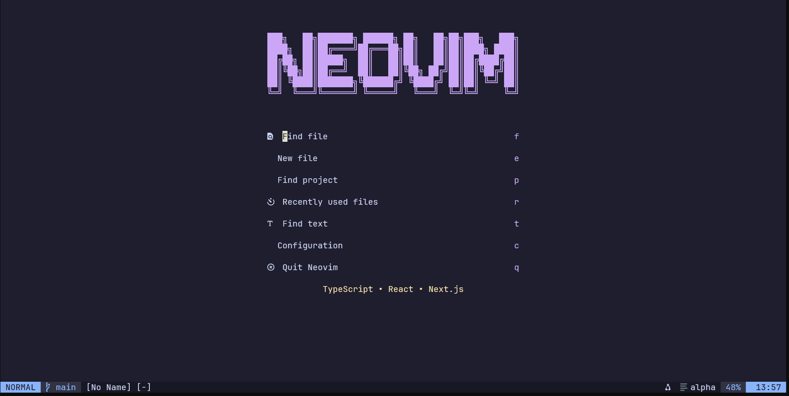
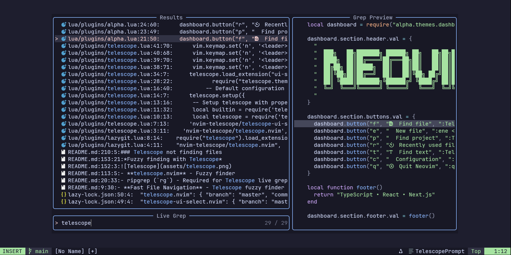
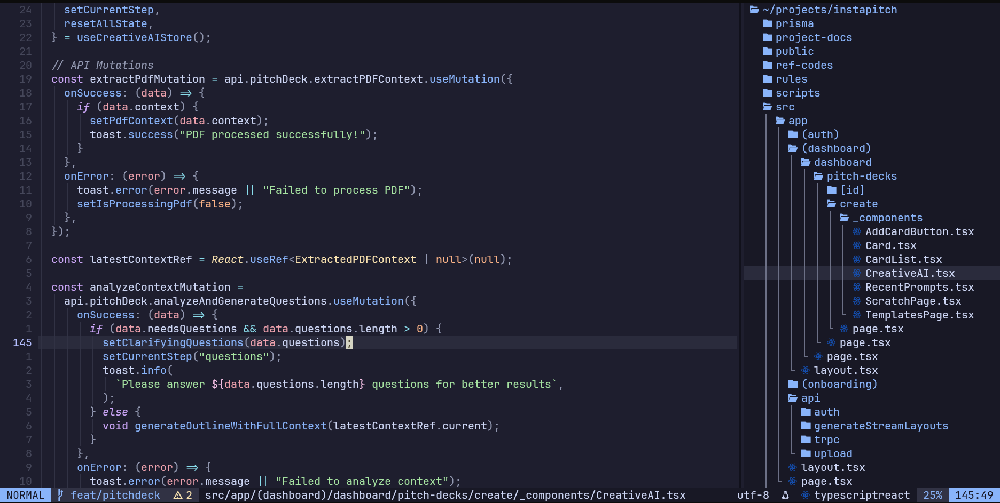

# Neovim Configuration

A modern Neovim configuration focused on TypeScript and React development with extensive LSP support and carefully selected plugins.

## Features

- **Full LSP Support** - Intelligent code completion, diagnostics, and navigation
- **TypeScript & React** - First-class support with dedicated tooling
- **Fast File Navigation** - Telescope fuzzy finder with ripgrep integration
- **Git Integration** - Fugitive, Gitsigns, and Lazygit for complete git workflow
- **Modern UI** - Aether theme with custom dashboard and statusline
- **Smart Code Editing** - Treesitter syntax highlighting and text objects
- **Debugging Support** - DAP integration for debugging applications

## Prerequisites

- Neovim >= 0.11.0
- Git
- Node.js & npm
- ripgrep (`rg`) - Required for Telescope live grep
- fd - For better file finding performance
- A [Nerd Font](https://www.nerdfonts.com/) - For icons and symbols

### Installation on Arch Linux

```bash
sudo pacman -S neovim ripgrep fd nodejs npm
```

## Installation

1. Backup your existing Neovim configuration:
```bash
mv ~/.config/nvim ~/.config/nvim.bak
```

2. Clone this repository:
```bash
git clone https://github.com/ProdigyRahul/dotvim.git ~/.config/nvim
```

3. Start Neovim and let Lazy.nvim install plugins:
```bash
nvim
```

4. Install LSP servers:
```bash
:Mason
```

## Key Bindings

### Essential Mappings

| Key | Description | Mode |
|-----|-------------|------|
| `<Space>` | Leader key | Normal |
| `<C-p>` | Find files | Normal |
| `<leader>fg` | Live grep | Normal |
| `<leader>fb` | Browse buffers | Normal |
| `<C-n>` | Toggle file tree | Normal |

### Navigation

| Key | Description | Mode |
|-----|-------------|------|
| `<C-h/j/k/l>` | Navigate windows | Normal |
| `<leader>hh` | Harpoon menu | Normal |
| `<leader>ha` | Add to Harpoon | Normal |
| `<leader>1..5` | Harpoon file slots | Normal |
| `s` | Flash jump | Normal |
| `S` | Flash treesitter | Normal |

### Code Actions

| Key | Description | Mode |
|-----|-------------|------|
| `gd` | Go to definition | Normal |
| `gr` | Find references | Normal |
| `K` | Hover documentation | Normal |
| `<leader>ca` | Code actions | Normal |
| `<leader>rn` | Rename symbol | Normal |
| `<leader>f` | Format buffer | Normal |

### Git

| Key | Description | Mode |
|-----|-------------|------|
| `<leader>gs` | Git status | Normal |
| `<leader>gp` | Git push | Normal |
| `<leader>gP` | Git pull | Normal |
| `<leader>gl` | Git log | Normal |
| `<leader>gg` | Lazygit | Normal |

## Plugin Categories

### Core

- **lazy.nvim** - Modern plugin manager
- **plenary.nvim** - Lua utility functions
- **nvim-web-devicons** - File icons

### Editor Enhancement

- **nvim-treesitter** - Advanced syntax highlighting
- **nvim-autopairs** - Auto close brackets
- **Comment.nvim** - Smart commenting
- **nvim-surround** - Surround text objects
- **flash.nvim** - Enhanced motions

### File Management

- **telescope.nvim** - Fuzzy finder
- **neo-tree.nvim** - File explorer
- **harpoon** - Quick file navigation

### LSP & Completion

- **nvim-lspconfig** - LSP configuration
- **mason.nvim** - LSP server installer
- **nvim-cmp** - Completion engine
- **typescript-tools.nvim** - TypeScript utilities
- **tailwind-tools.nvim** - Tailwind CSS support

### Git

- **vim-fugitive** - Git commands
- **gitsigns.nvim** - Git decorations
- **lazygit.nvim** - Lazygit integration

### UI

- **aether.nvim** - Color scheme
- **alpha-nvim** - Dashboard
- **lualine.nvim** - Status line
- **noice.nvim** - UI enhancements

> Note: `bufferline.nvim` and `catppuccin` are present but currently disabled in this config.

### Development Tools

- **nvim-dap** - Debug Adapter Protocol
- **conform.nvim** - Code formatting
- **nvim-lint** - Linting
- **todo-comments.nvim** - Highlight TODOs
- **trouble.nvim** - Diagnostics list

## Screenshots


*Alpha dashboard with quick actions*


*Fuzzy finding with Telescope*


*TypeScript development with LSP*

## Language Support

### TypeScript/JavaScript
- Full LSP support with typescript-tools.nvim
- ESLint and Prettier integration
- React/JSX support

### Tailwind CSS
- Intelligent completions
- Color previews
- Class sorting

> Note: `tailwind-tools.nvim` is currently disabled until it updates for Neovim 0.11.

### Other Languages
- HTML/CSS
- JSON
- Markdown
- Lua
- YAML

## Customization

### Adding Plugins

Edit `lua/plugins/` directory to add new plugin configurations:

```lua
-- lua/plugins/your-plugin.lua
return {
  "author/plugin-name",
  config = function()
    -- Plugin configuration
  end
}
```

### Modifying Settings

Core settings are in `lua/vim-settings.lua`. Adjust options like:
- Tab width
- Theme
- Keybindings
- UI preferences

### LSP Configuration

LSP servers are configured in `lua/plugins/lsp-config.lua`. Add new servers through Mason or modify existing configurations.

## Troubleshooting

### Telescope not finding files
Ensure ripgrep and fd are installed:
```bash
which rg fd
```

### Icons not displaying
Install a Nerd Font and configure your terminal to use it.

### LSP not working
1. Check Mason for installed servers: `:Mason`
2. Verify Node.js is installed: `node --version`
3. Check LSP status: `:LspInfo`

## Performance

This configuration is optimized for performance:
- Lazy loading of plugins
- Minimal startup time
- Efficient keybindings
- Smart caching

## Contributing

Feel free to fork and customize. Pull requests for improvements are welcome.

## License

MIT License - See LICENSE file for details

## Acknowledgments

Built with inspiration from the Neovim community and various dotfile repositories.

---

*For questions or issues, please open an issue on [GitHub](https://github.com/ProdigyRahul/dotvim/issues)*
